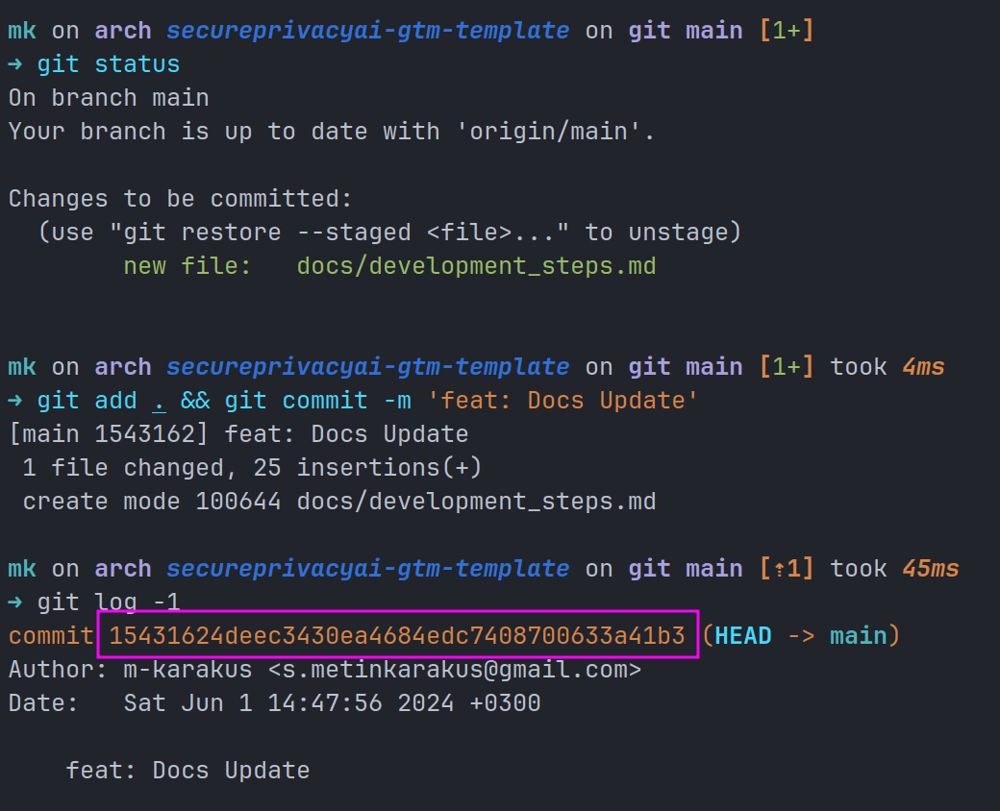
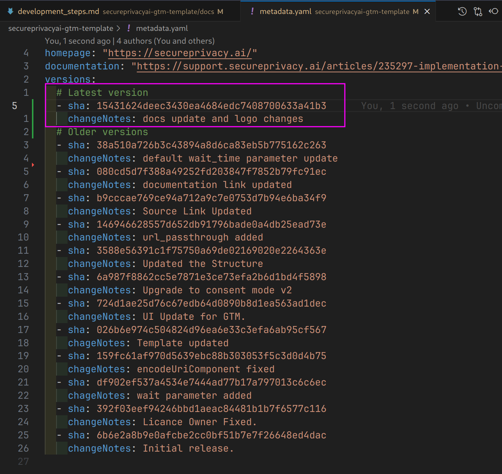
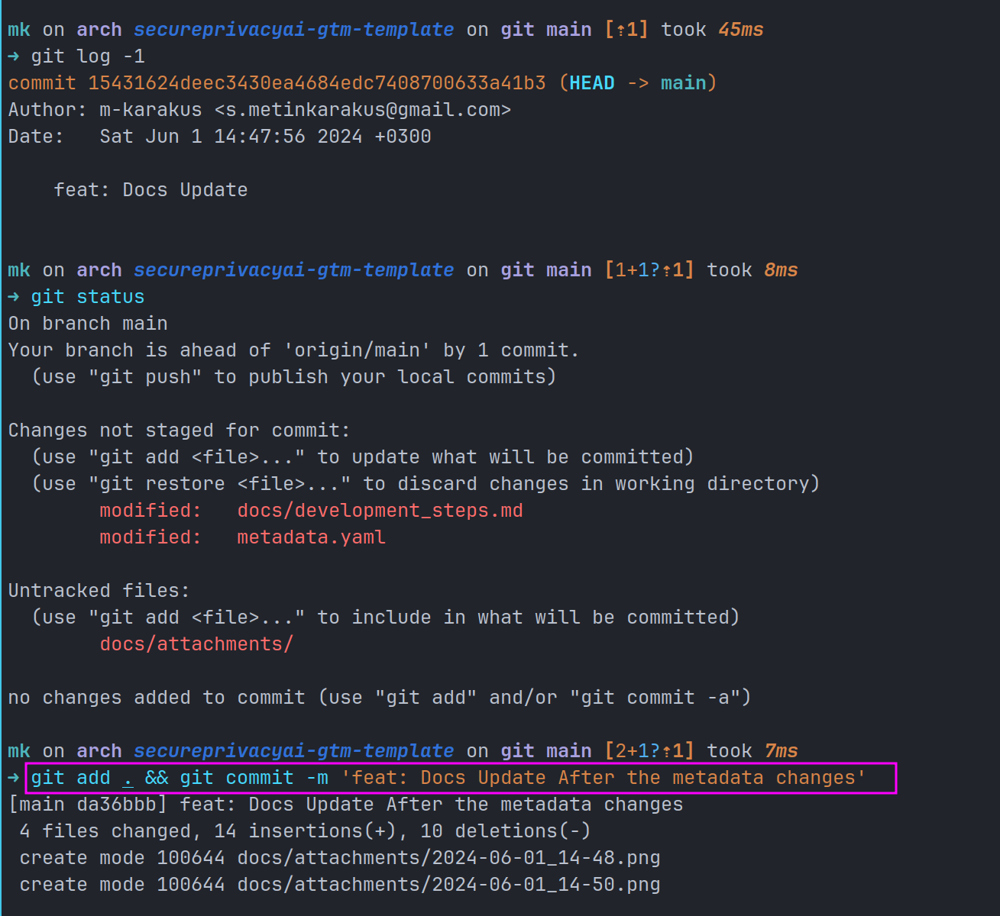

# Development Steps

1. Do the changes on the template files.  
2. Commit your changes like:  
    ```bash
    git add . && git commit -m 'feat: Docs Update'
    ```
3. Get the latest commit hash with below code:  
    ```bash
    git log -1
    ```  
      
4. Open the [metadata.yaml](../metadata.yaml)  
5. Insert 2 new lines __top of the sha part__, your new sha is lates commit id  
    ```yml
    - sha: <LAST_COMMIT_ID>
      changeNotes: default wait_time parameter update
    ```  
      
6. Recommit your new changes, because we updated [metadata.yaml](../metadata.yaml)  
    ```bash
    git add . && git commit -m 'feat: Docs Update'
    ```  
      
7. Push your changes to the GitHub  
   ```bash
   git push
   ```  
     

